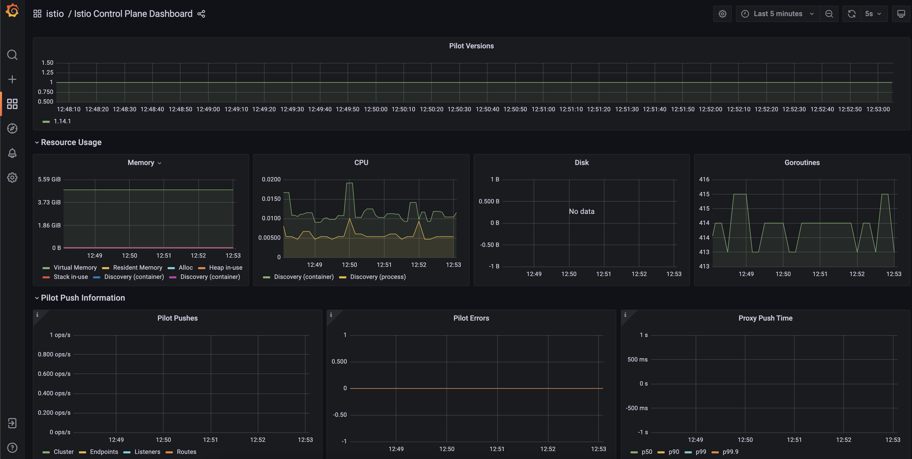

# istio-demo
This repository includes a demo of Istio service-mesh in AWS.

Table of Contents
=================

* [istio\-demo](#istio-demo)
  * [Initial Considerations](#initial-considerations)
  * [Start istio Demo](#start-istio-demo)
    * [Install istio in the cluster\.](#install-istio-in-the-cluster)
    * [Setup istio\-injection label](#setup-istio-injection-label)
  * [config demo apps\.](#config-demo-apps)
    * [Install demo deployment and services](#install-demo-deployment-and-services)
      * [AWS sec\. group inbound rules\.](#aws-sec-group-inbound-rules)
    * [Describe The pods](#describe-the-pods)
      * [istio labels](#istio-labels)
      * [Init containers](#init-containers)
      * [Istio sidecar](#istio-sidecar)
  * [Visualization](#visualization)
    * [Kiali](#kiali)
    * [Generating traffic between apps](#generating-traffic-between-apps)
      * [Kiali](#kiali-1)
      * [Grafana](#grafana)
  * [Ingress (Human\-&gt;Service)](#ingress-human-service)
  * [With an NGINX proxy\.](#with-an-nginx-proxy)
  * [Clean\-up your Demo](#clean-up-your-demo)

## Initial Considerations

1. This demo is tested with a cluster created with EKS. Only AWS configuration are specific ie. security groups config, but istio works in any kubernetes cluster.

2. Also this is develop with **istioctl**. Istioctl isn't necessary, but made easy to run this demo.You can install it with:

```bash
brew install istioctl
```

3. I develop this guide under a demo namespace call it: `my-app`. This in order to avoid issues with other namespaces running in the cluster.

## Start istio Demo

### Install istio in the cluster.
Execute this to install istio in your cluster. 

```bash
istioctl install --set profile=demo -y

✔ Istio core installed 
✔ Istiod installed 
✔ Ingress gateways installed   
✔ Egress gateways installed  
✔ Installation complete 
Making this installation the default for injection and validation.
```

This creates a new namespace `istio-system` and start istio core, ingress and egress gateways controllers. Verify it with:

```bash
$ kube get pods -n istio-system

NAME                                    READY   STATUS    RESTARTS   AGE
istio-egressgateway-59d4c446df-5vq92    1/1     Running   0          5m54s
istio-ingressgateway-67d6475549-dj7sc   1/1     Running   0          5m54s
istiod-544bd8d6bc-2qnlh                 1/1     Running   0          6m6s
```
### Setup istio-injection label
To automatically start the istio side-cars in every new deployment only execute:

```bash
kubectl label namespace my-app istio-injection=enabled
```
## config demo apps.

### Install demo deployment and services
In this repo you will find two demo apps. Deploy both in your cluster with:

```bash
kubectl apply -f my-app-v1.yaml -n my-app
kubectl apply -f my-app-v2.yaml -n my-app
```

Verify it is working with:

```bash
$ kubectl get pods -o wide -n my-app
NAME                         READY   STATUS    RESTARTS   AGE     IP            NODE                 NOMINATED NODE   READINESS GATES
my-app-v1-6f47ff4f6b-9bjkt   2/2     Running   0          4m31s   10.244.0.9    kind-control-plane   <none>           <none>
my-app-v1-6f47ff4f6b-gqjdm   2/2     Running   0          4m31s   10.244.0.8    kind-control-plane   <none>           <none>
my-app-v2-786b96d668-7h29p   2/2     Running   0          4m24s   10.244.0.11   kind-control-plane   <none>           <none>
my-app-v2-786b96d668-ftcw2   2/2     Running   0          4m24s   10.244.0.10   kind-control-plane   <none>           <none>
```

#### AWS sec. group inbound rules.

Since your nodes are running behind a security group, the following inbound rules are necessary to add: 

| Port      | Description |
| ----------- | ----------- |
| 15014 | Istio Http-monitoring |
| 15010 | grpc-xds |
| 15017 | necessary for init container |
| 15017 | istio http-dns |
| 20001 | kiali api endpoint |
| 9090 | kiali metrics |

### Describe The pods

```bash 
$ kubectl describe pod my-app-v1-the-uuid -n my-app
```
Since we add the label: `istio-injection=enabled`, istio add some elements in the podspec:

#### istio labels

Istio add labels for tlsMode and canonical.

```bash
Labels:       app=my-app-v1
              pod-template-hash=6f47ff4f6b
              security.istio.io/tlsMode=istio
              service.istio.io/canonical-name=my-app-v1
              service.istio.io/canonical-revision=latest
```
#### Init containers

Istio starts a init-container to setup an iptables route to force that the traffic incoming to the pod cross firts into the envoy-proxy side-car
```bash
Init Containers:
  istio-init:
    Container ID:  containerd://a239cefe6e1fb5e03cfb52aa81f81f325a3216bdea7c3592e707a30fc61d39ca
    Image:         docker.io/istio/proxyv2:1.14.1
    Image ID:      docker.io/istio/proxyv2@sha256:df69c1a7af7c0113424a48f5075ac6d0894123ec926fdb315e849b4f04e39616
    Port:          <none>
    Host Port:     <none>
    Args:
      istio-iptables
      -p
      15001
      -z
      15006
      -u
      1337
      -m
      REDIRECT
      -i
      *
      -x
      
      -b
      *
      -d
      15090,15021,15020
    State:          Terminated
      Reason:       Completed
      Exit Code:    0
      Started:      Fri, 08 Jul 2022 11:02:45 -0500
      Finished:     Fri, 08 Jul 2022 11:02:45 -0500
    Ready:          True
    Restart Count:  0
    Limits:
      cpu:     2
      memory:  1Gi
    Requests:
      cpu:        10m
      memory:     40Mi
    Environment:  <none>
    Mounts:
      /var/run/secrets/kubernetes.io/serviceaccount from kube-api-access-rxn56 (ro)
```

#### Istio sidecar 

The istio sidecar is an envoy proxy.

```bash
Containers:
  istio-proxy:
    Container ID:  containerd://82059c1fd0bc2663436308d2b05065ab2a89111c632196b18ce3f93caa76ac41
    Image:         docker.io/istio/proxyv2:1.14.1
    Image ID:      docker.io/istio/proxyv2@sha256:df69c1a7af7c0113424a48f5075ac6d0894123ec926fdb315e849b4f04e39616
    Port:          15090/TCP
    Host Port:     0/TCP
    Args:
      proxy
      sidecar
      --domain
      $(POD_NAMESPACE).svc.cluster.local
      --proxyLogLevel=warning
      --proxyComponentLogLevel=misc:error
      --log_output_level=default:info
      --concurrency
      2
    State:          Running
      Started:      Fri, 08 Jul 2022 11:02:49 -0500
    Ready:          True
    Restart Count:  0
    Limits:
      cpu:     2
      memory:  1Gi
    Requests:
      cpu:      10m
      memory:   40Mi
    Readiness:  http-get http://:15021/healthz/ready delay=1s timeout=3s period=2s #success=1 #failure=30
    Environment:
      JWT_POLICY:                    third-party-jwt
      PILOT_CERT_PROVIDER:           istiod
      CA_ADDR:                       istiod.istio-system.svc:15012
      POD_NAME:                      my-app-v1-6f47ff4f6b-9bjkt (v1:metadata.name)
      POD_NAMESPACE:                 my-app (v1:metadata.namespace)
      INSTANCE_IP:                    (v1:status.podIP)
      SERVICE_ACCOUNT:                (v1:spec.serviceAccountName)
      HOST_IP:                        (v1:status.hostIP)
      PROXY_CONFIG:                  {}
                                     
      ISTIO_META_POD_PORTS:          [
                                         {"containerPort":8080,"protocol":"TCP"}
                                     ]
      ISTIO_META_APP_CONTAINERS:     hello
      ISTIO_META_CLUSTER_ID:         Kubernetes
      ISTIO_META_INTERCEPTION_MODE:  REDIRECT
      ISTIO_META_WORKLOAD_NAME:      my-app-v1
      ISTIO_META_OWNER:              kubernetes://apis/apps/v1/namespaces/my-app/deployments/my-app-v1
      ISTIO_META_MESH_ID:            cluster.local
      TRUST_DOMAIN:                  cluster.local
    Mounts:
      /etc/istio/pod from istio-podinfo (rw)
      /etc/istio/proxy from istio-envoy (rw)
      /var/lib/istio/data from istio-data (rw)
      /var/run/secrets/istio from istiod-ca-cert (rw)
      /var/run/secrets/kubernetes.io/serviceaccount from kube-api-access-rxn56 (ro)
      /var/run/secrets/tokens from istio-token (rw)
      /var/run/secrets/workload-spiffe-credentials from workload-certs (rw)
      /var/run/secrets/workload-spiffe-uds from workload-socket (rw)
```

## Visualization
### Kiali

Kiali is the istio graphic interface to visualize what is happening in the cluster communications.

```bash
kubectl apply -f https://raw.githubusercontent.com/istio/istio/release-1.14/samples/addons/kiali.yaml
istioctl dashboard kiali
```
**In AWS use portforward**

Ones you execute kiali, you will se this:


If you are getting errors like: `Could not fetch health: Error while fetching app health: Post "http://prometheus.istio-system:9090/api/v1/query": dial tcp: lookup prometheus.istio-system on 10.96.0.10:53: no such host` It will be necessary to install prometheus, grafana and jaeger in your cluster to let kiali graphic metrics and trace the communication between pods. 

Execute the following commands.

```bash
# Install prometheus:

kubectl apply -f https://raw.githubusercontent.com/istio/istio/release-1.14/samples/addons/prometheus.yaml

# Install grafana:

kubectl apply -f https://raw.githubusercontent.com/istio/istio/release-1.14/samples/addons/grafana.yaml

# Install jaeger:

kubectl apply -f https://raw.githubusercontent.com/istio/istio/release-1.14/samples/addons/jaeger.yaml

```

The above commands install prometheus, grafana and jaeger under `istio-system` namespace.

### Generating traffic between apps

Now istio is working and you will be able to see how service mesh works between services. SSH to one of your pods and execute:

```bash
kubectl exec -it <my-app-pod> -n my-app

# In the pod shell execute

apk add --update curl
while sleep 1; do curl -o /dev/null -s -w %{http_code} http://feli-app-v1-svc:80/; done
200200
```

#### Kiali
Ones this while execution is running go again to your kaili dashboard and now you will be able to see traffic between pod and service 1.


#### Grafana

Since istio is reporting metrics with prometheus, you will also able to see insteresting dashboard using grafana. 



Available dashboards by default:

* Istio Control Plane Dashboard
* Istio Mesh Dashboard
* Istio Performance Dashboard
* Istio Service Dashboard
* Istio Wasm Extension Dashboard
* Istio Workload Dashboard

## Ingress (Human->Service)

In istio ingress are named as Gateway. IN our current demo config, we gonna setup the ingress for the host: `*`.

To start, apply the changes to create the ingress gateway:

```bash
kubectl apply -f ./sample-apps/ingress.yaml -n <my-namespace>

```

To configure communication with the cluster from your local CLI, follow this:

1. Describe the service istio-ingressgateway. 
```bash
kube describe service istio-ingressgateway -n istio-system
```

2. In the output identify the `LoadBalancer Ingress:` config.

```bash
Name:                     istio-ingressgateway
Namespace:                istio-system
Labels:                   app=istio-ingressgateway
                          install.operator.istio.io/owning-resource=unknown
                          install.operator.istio.io/owning-resource-namespace=istio-system
                          istio=ingressgateway
                          istio.io/rev=default
                          operator.istio.io/component=IngressGateways
                          operator.istio.io/managed=Reconcile
                          operator.istio.io/version=1.14.1
                          release=istio
Annotations:              <none>
Selector:                 app=istio-ingressgateway,istio=ingressgateway
Type:                     LoadBalancer
IP Family Policy:         SingleStack
IP Families:              IPv4
IP:                       172.20.42.127
IPs:                      172.20.42.127
LoadBalancer Ingress:     ae7f6f9da523d4b0da5e96dda3bc050e-1880156565.us-east-1.elb.amazonaws.com

....
```

Copy the ALB ingress DNS. and now you will be able to test with 

```bash
while sleep 1; do curl -o /dev/null -s -w %{http_code} http://ae7f6f9da523d4b0da5e96dda3bc050e-1880156565.us-east-1.elb.amazonaws.com/v2; done
200200
```
This will generate traffic from your local machine to the `my-app-svc-v2` in the cluster. You can verify this in kiali. 

This is how everything should look in kiali:


## With an NGINX proxy.

In this case we gonna made a traffic simulation including a NGINX proxy. This proxy includes a single Deployment a Service listening in port 80 and a Configmap to redirect to my-app-v1 or my-app-v2 according to the URL path. 

Execute the deployment with:

```bash

kubectl apply -f ./sample-apps/nginx-proxy.yaml -n <my-namespace>

```

Onces the NGINX deployment is up, you will see the istio side-car is up an running in the NGINX pods. Now stablish a port-forward to the nginx proxy with the following command:

```bash
kubectl port-forward svc/nginx-svc 8080:80
```
And then execute a while curl requests:

```bash
while sleep 1; do curl localhost:8080/v1 && curl localhost:8080/v2; done
```

This will simulate communication to an already existing nginx proxy, and how istio implementation won't block the current communication. And the IngressGateway cool work if the cluster already had a nginx proxy.

If you go to kiali dashboard you will see the following:


## Clean-up your Demo

Since the demos is running in specific namespaces: `istio-system` and `my-app`. You can delete all the demo work deleting the namespaces with the following commands:

```bash
kubectl delete namespace istio-system
kubectl delete namespace my-app
```
